<p align="center">
  
</p>

<h1 align="center">MAT Bank</h1>

<p align="center">
  A desktop banking app, first built by three students in 2022 and rebuilt in 2026 with JavaFX 21.<br>
  <a href="https://github.com/Abrar118/Final_bank/actions/workflows/ci.yml"></a>
  
  
  <a href="LICENSE"></a>
</p>

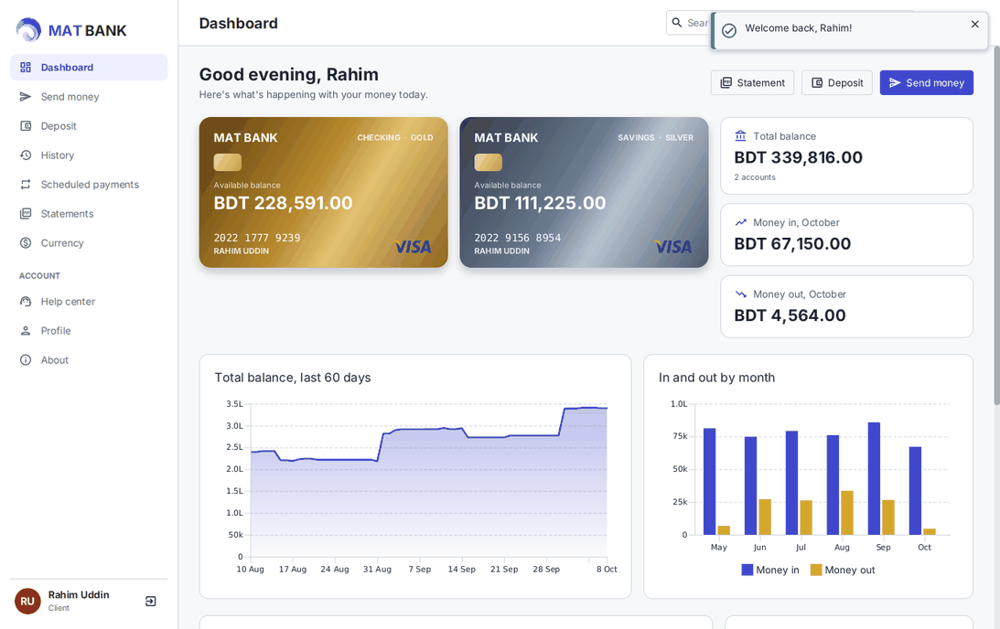

## The story

MAT Bank started in 2022 as a JavaFX course project by **Abrar Mahir Esam**, **Mehmil Khan** and **Farheen Mahjarin
Trisha**, students of Computer Science and Engineering at the Military Institute of Science and Technology (MIST).
It had a welcome slideshow, client and admin sign-in, deposits, transfers, a currency converter and a help center.

Version 2.0 is a tribute rebuild. It keeps the same screens and ideas: the slideshow, the gold and silver cards, the
three-step deposit, the 5% charge with its 3% discount, and admin PIN 1111. The foundations underneath are new. The
original code is preserved, untouched, on the [`legacy-2022`](https://github.com/Abrar118/Final_bank/tree/legacy-2022)
branch.

| | 2022 | 2026 |
|---|---|---|
| Platform | JDK 19, JavaFX 19 early access | JDK 21 LTS, JavaFX 21 LTS |
| Storage | Text files in `~/Music/Data` | SQLite with versioned migrations |
| Money | `double`, rounded on screen | Exact integer poisha in one ledger with running balances |
| Passwords | Plain text | bcrypt hashes, lockout after 5 attempts, audit log |
| Forgot password | Email OTP through a hard-coded Gmail login | Admin-issued temporary password |
| Transfers | Sender debited even if the recipient didn't exist | One database transaction: all or nothing |
| UI | A new window for every screen, FXML from Scene Builder | One window, light and dark themes |
| Tests | None | 84 JUnit tests, including UI flows on a virtual display |
| Distribution | A Google Drive download link | Native installers (deb, dmg, msi) built by GitHub Actions |
| New in 2.0 | | PDF statements, scheduled payments, live exchange rates, search |

## Try it

On first launch MAT Bank creates a demo bank with five months of history, so there's something to explore right
away. The sign-in screen has one-click buttons for these accounts:

| Account | Email | Password | PIN |
|---|---|---|---|
| Client | `rahim@matbank.demo` | `demo1234` | |
| Client | `nusrat@matbank.demo` | `demo1234` | |
| Admin | `admin@matbank.demo` | `admin2022` | `1111` |

The other demo clients are `tanvir@`, `farhana@` and `sabbir@matbank.demo`, also with `demo1234`.

### Install

Once a version is tagged, the [Releases](https://github.com/Abrar118/Final_bank/releases) page has an installer for
each system: `.deb` for Debian/Ubuntu, `.dmg` for macOS, `.msi` for Windows. Each one bundles its own Java runtime.
The installers aren't code-signed. On macOS, right-click the app and choose **Open** the first time; on Windows, choose
**More info → Run anyway**.

### Run from source

You need JDK 21. Maven comes with the project.

```bash
git clone https://github.com/Abrar118/Final_bank.git
cd Final_bank
./mvnw javafx:run          # Windows: mvnw.cmd javafx:run
```

## Features

**Clients**
- Dashboard with gold (checking) and silver (savings) cards, 60-day balance trend, monthly in/out chart, recent
  activity, upcoming payments and the original quick links
- Send money to other clients, with a live receipt preview showing the 5% charge and 3% discount
- Move money between your own checking and savings for free
- Three-step deposit wizard (amount → reference → receipt) with the 2% handling fee
- Transaction history with search across names, notes and references, plus account, type and date filters
- Scheduled payments (daily, weekly, monthly); payments missed while the app was closed are caught up at the next launch
- PDF statements for any account and period
- Currency converter with live taka rates, a 6-hour cache and bundled offline rates
- Help center: message the bank (visitors too) and rate the app with stars
- Profile with photo, editable details, password change

**Admins**
- Overview: clients, deposits held, today's sign-ins, unread messages, transactions per day
- Clients: search, open accounts with opening balances, issue temporary passwords, close accounts
- Inbox for help-center messages and feedback
- Sign-in activity (successful and failed) and an audit log of security-relevant actions
- PIN change alongside the password

<details>
<summary><strong>More screenshots</strong></summary>

| | |
|---|---|
| 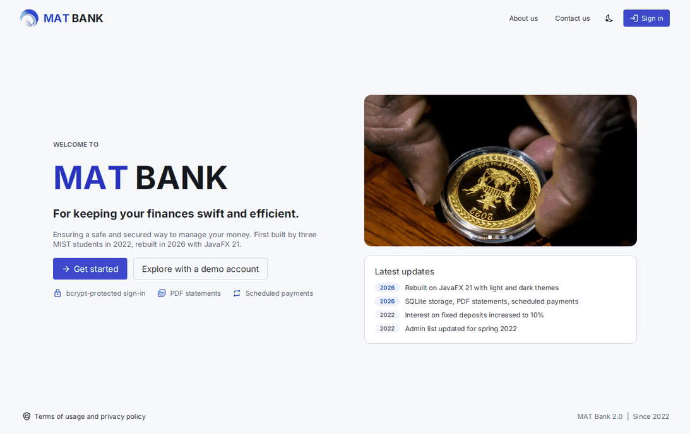 | 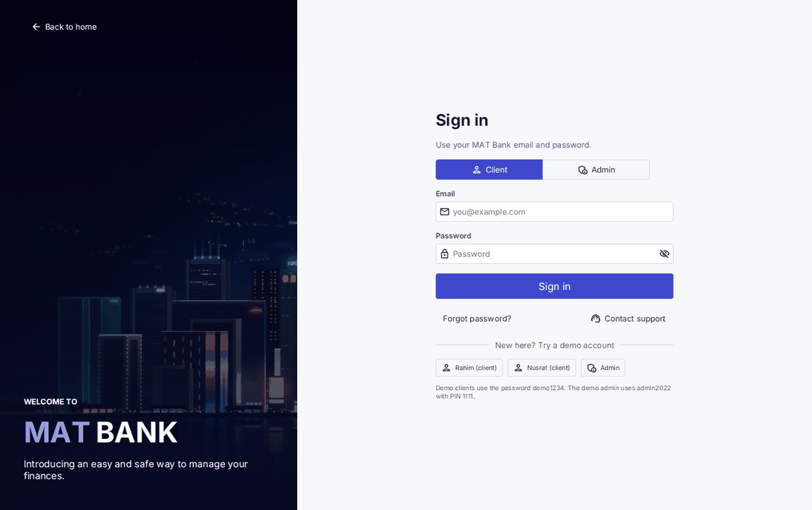 |
| 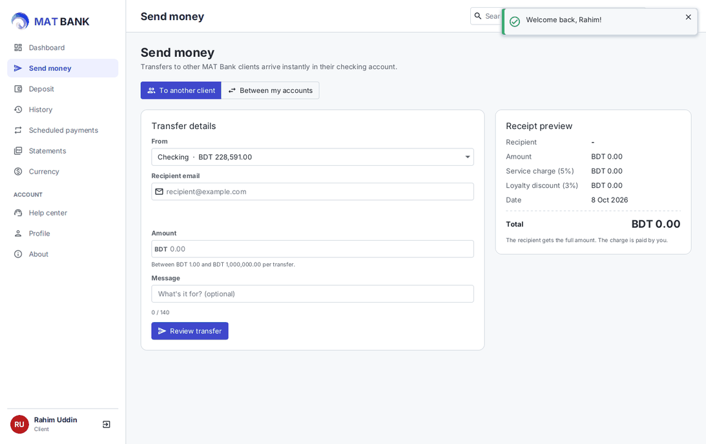 | 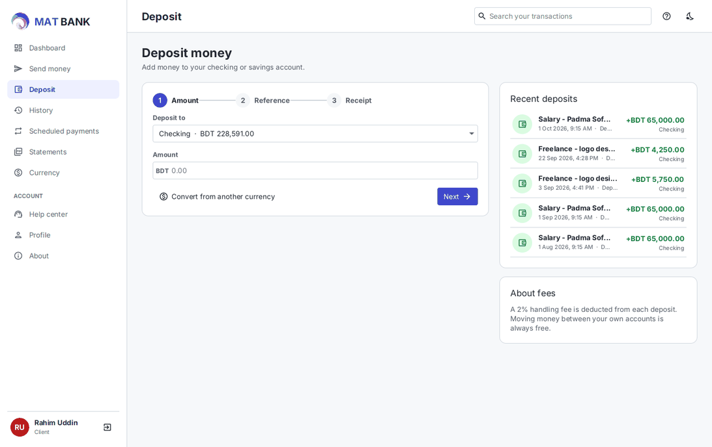 |
| 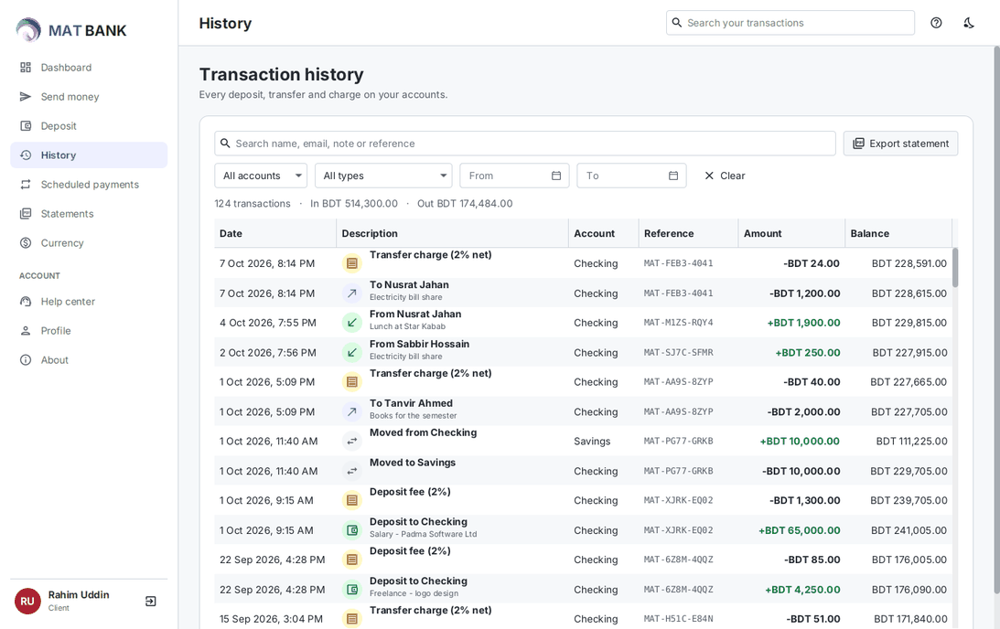 | 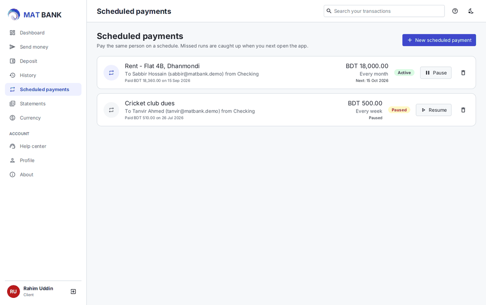 |
| 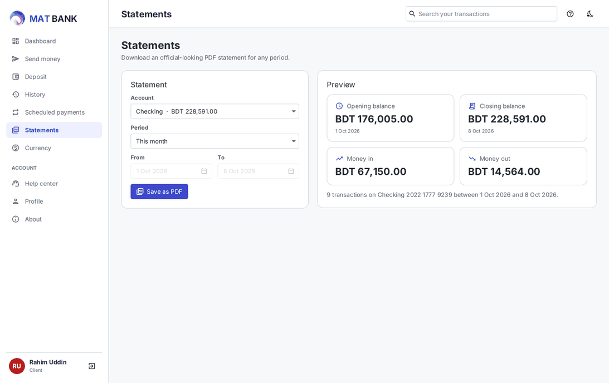 | 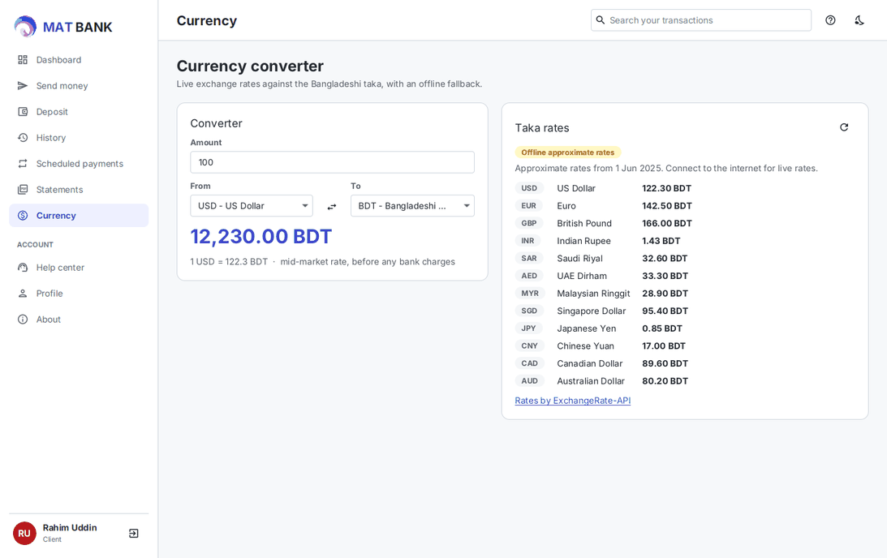 |
| 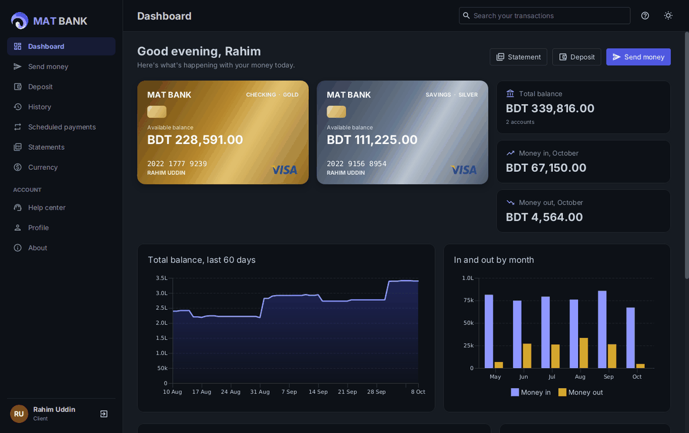 | 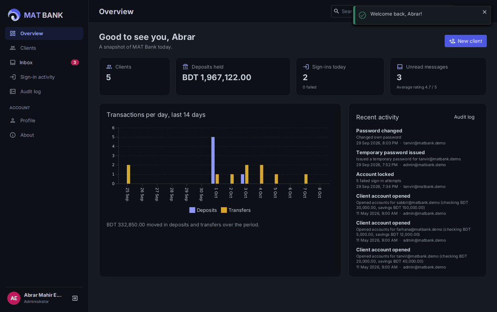 |
| 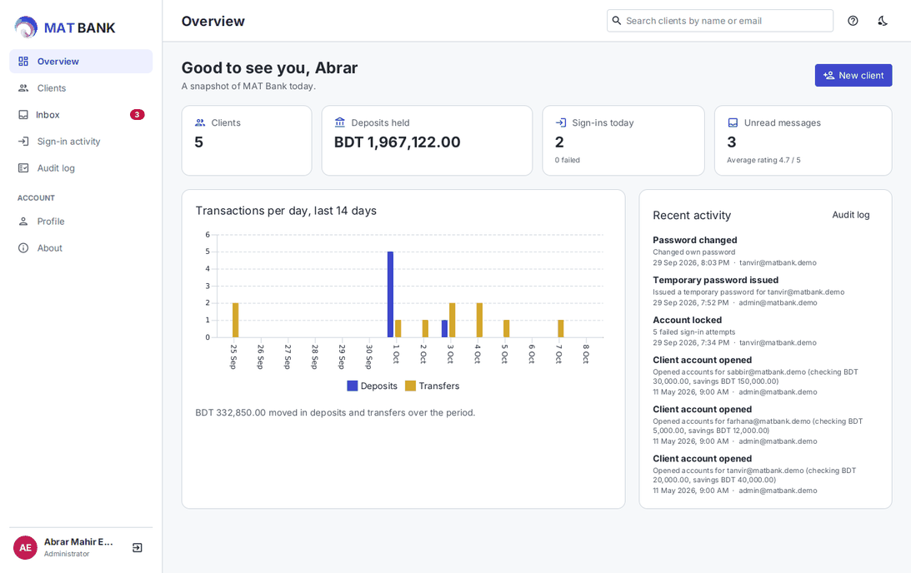 | 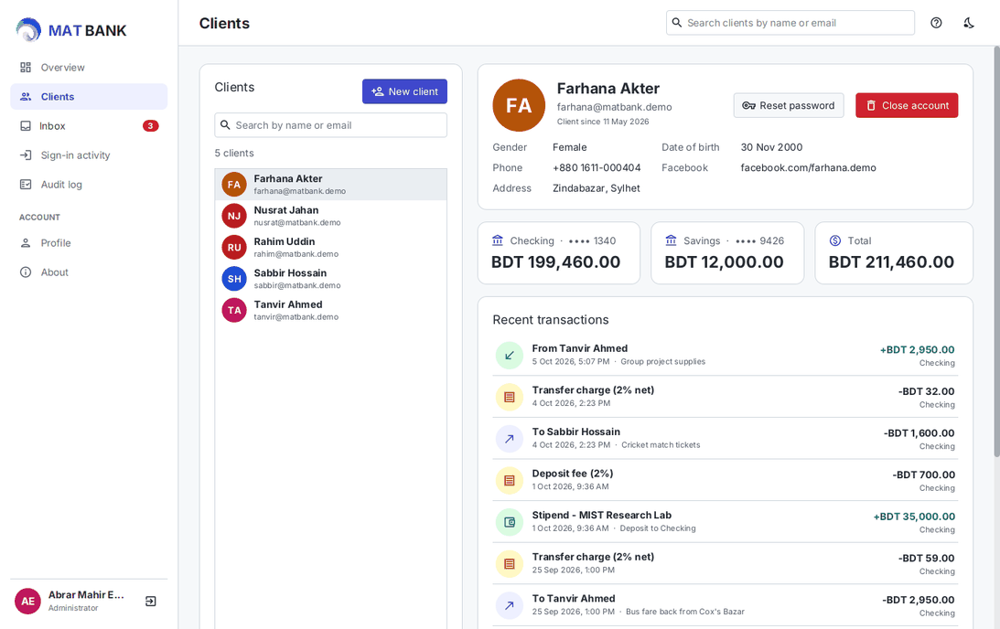 |
| 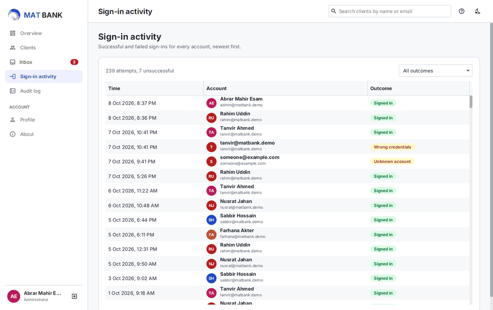 | 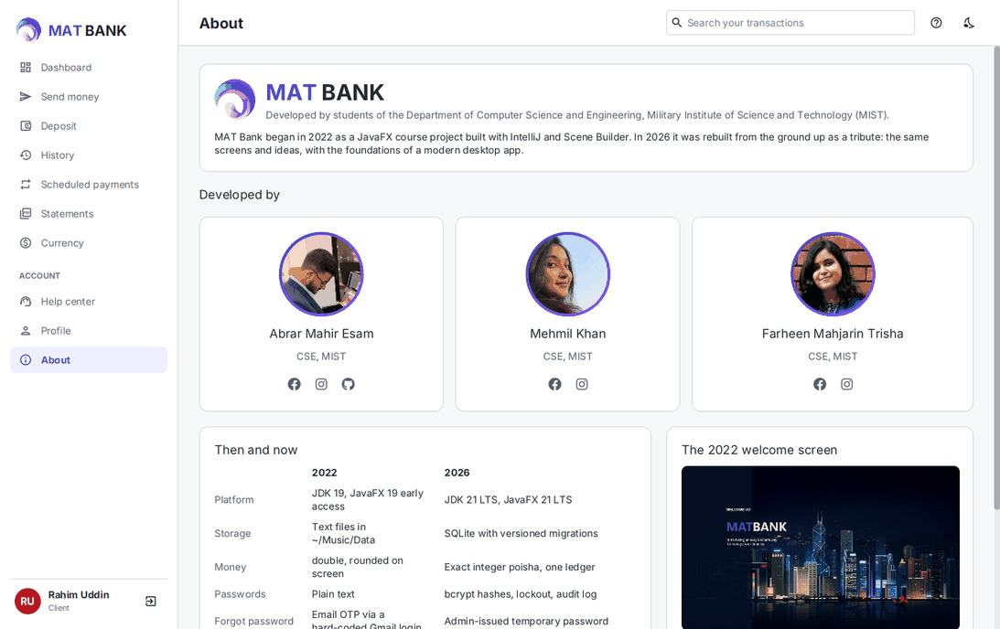 |

</details>

## How it's built

```
ui/        JavaFX views built in code (no FXML), AtlantaFX theme, Ikonli icons
  auth/      welcome and sign-in          client/   the client's pages
  admin/     the admin's pages            common/   help, profile, about
  components/ cards, rows, charts, inputs
service/   business rules: AuthService, BankingService, LedgerService, AdminService,
           RecurringPaymentService, StatementService, ExchangeRateService, ...
db/        SQLite access: Database (connections, transactions), Migrator, one repository per table
domain/    records and enums: Money, Account, LedgerEntry, User, ...
demo/      DemoSeeder replays months of activity through the real services
```

Some decisions worth knowing:

- **Money is integer poisha.** `Money` wraps a `long`, and percentages round half-even. Every balance change writes a
  ledger line with the running balance, and the tests check that every balance equals the sum of its ledger.
- **Transfers can't half-happen.** Each operation is one `BEGIN IMMEDIATE` SQLite transaction. The debit is a guarded
  `UPDATE ... WHERE balance >= amount`, so concurrent transfers can't overdraw an account. There's a test for that.
- **No FXML.** Views are plain Java, which keeps them refactorable and testable. The UI tests drive the real
  sign-in, transfer and deposit flows and check the database.
- **AtlantaFX 2.1**, because AtlantaFX 3.0 is built against JavaFX 27 and the app stays on the JavaFX 21 LTS line, which runs on Java 21.
- **Class path plus a jlinked runtime.** Some dependencies (bcrypt, PDFBox) aren't real Java modules. The installers
  therefore ship a trimmed Java 21 runtime that contains JavaFX, and run the app jars on the class path.
- **Slow work stays off the UI thread.** bcrypt, PDF rendering and network calls run on virtual threads.

### Where your data lives

| OS | Folder |
|---|---|
| Windows | `%APPDATA%\MAT Bank` |
| macOS | `~/Library/Application Support/MAT Bank` |
| Linux | `~/.local/share/mat-bank` |

Set `MATBANK_HOME` (or `-Dmatbank.home=...`) to use another folder. Delete the folder to start over with fresh demo
data. Start with `-Dmatbank.demo=false` for an empty bank.

## Development

```bash
./mvnw verify                                  # build + tests (UI tests run only when DISPLAY is set)
xvfb-run -a ./mvnw verify                      # include the UI tests on headless Linux
docs/screenshots.sh                            # regenerate docs/screenshots from a fresh demo bank
packaging/package.sh                           # native installer for this OS (deb / dmg / msi) in target/dist
packaging/package.sh app-image                 # just the runnable app folder
```

Pushing a tag such as `v2.0.0` runs the release workflow. It builds the installers on Linux, macOS and Windows and
attaches them to a GitHub release.

## Credits

- Original app (2022): Abrar Mahir Esam, Mehmil Khan, Farheen Mahjarin Trisha, CSE, MIST
- [AtlantaFX](https://github.com/mkpaz/atlantafx), [Ikonli](https://kordamp.org/ikonli/),
  [sqlite-jdbc](https://github.com/xerial/sqlite-jdbc), [bcrypt](https://github.com/patrickfav/bcrypt),
  [Apache PDFBox](https://pdfbox.apache.org/), [Jackson](https://github.com/FasterXML/jackson)
- Exchange rates by [ExchangeRate-API](https://www.exchangerate-api.com) (open access endpoint)

MAT Bank is a demo. It isn't a real bank and no real money moves.

## License

Licensed under the [Apache License, Version 2.0](LICENSE). Copyright 2022-2026 Abrar Mahir Esam, Mehmil Khan and
Farheen Mahjarin Trisha.
